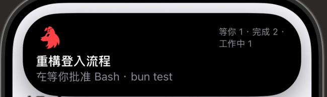
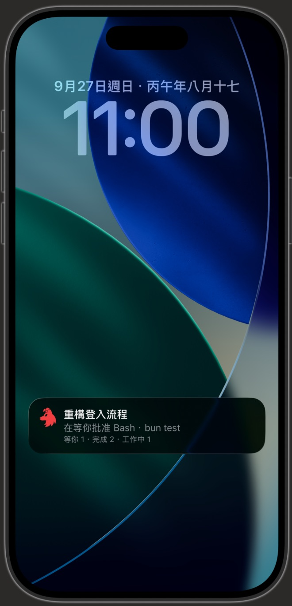

# Collie Island

An iPhone app that opens your Collie and puts its agents' state on the Dynamic Island. Tap the
island and it jumps to the pane that needs you most.

<p align="center">
  
  
</p>

Build it from source, or sideload the unsigned `CollieIsland.ipa` each release carries (see
"Install without Xcode"). Either way it is signed with your own Apple ID. A free Apple ID is
enough: no paid developer account, no APNs, no third-party server. It is not on the App Store and cannot be: it
stays awake in the background through location updates, which App Review does not accept for this
purpose.

## Set it up

You need a Mac with Xcode, an iPhone on iOS 18 or newer, and a Collie the phone can already reach
(usually its tailnet front door, with Tailscale on the phone).

1. Create your own settings file from the template.

   ```bash
   cp ios/Config.local.example.xcconfig ios/Config.local.xcconfig
   ```

2. Fill in its values: your Team ID, a bundle ID prefix of your own, and your Collie's address.
   `ISLAND_SHOW_DETAIL = YES` also shows what the top pane is doing on the island and the lock
   screen; that line can be your newest prompt word for word, so it is off by default.
3. Connect the iPhone to the Mac with a cable and trust the Mac on the phone.
4. Open `ios/CollieIsland.xcodeproj` in Xcode and sign in to your Apple ID under Settings → Accounts.
5. Choose your iPhone as the run destination and press Run.
6. On the phone, trust your developer certificate (Settings → General → VPN & Device Management) and
   turn on Developer Mode.
7. Open the app and allow location **Always**, so the island keeps updating in the background.
8. Lock the phone and tap **Allow** when iOS asks whether to allow Live Activities from Collie.

iOS asks that once, on the lock screen, the first time the app shows a Live Activity. Tapping
Don't Allow turns off the island and the lock-screen card; turn Live Activities back on in the
app's page in the Settings app, where it is listed as Collie.

Every value lives in `Config.local.xcconfig`, which git ignores; `Config.xcconfig` only holds the
defaults. An app built without a Collie address asks for one the first time it opens.

## Install without Xcode

Download `CollieIsland.ipa` from the newest release and sign it with your own Apple ID through
AltStore. A free Apple ID is enough; the app then has to be refreshed every 7 days, which AltStore
does in the background.

You need an iPhone on iOS 18 or newer, Tailscale on the phone reaching your Collie, and a Mac or
Windows PC on the same Wi-Fi to run AltServer. That can be the machine that runs Collie.

> **Note.** AltServer has no Linux version. If Collie runs on Linux or on a server away from home,
> run AltServer on any Mac or Windows PC at home instead.

### Set up AltStore (once)

These steps are for macOS; Windows follows [AltStore's Windows guide](https://faq.altstore.io/altstore-classic/how-to-install-altstore-windows).

1. Install AltServer.

   ```bash
   brew install --cask altserver
   ```

2. Open AltServer from Applications, and allow it to find devices on the local network.
3. If its menu shows "Install Mail Plug-in...", follow [AltStore's Mail plug-in steps](https://faq.altstore.io/altstore-classic/how-to-install-altstore-macos/enable-mail-plug-in).
4. Connect the iPhone with a cable and trust the computer on the phone.
5. Choose Install AltStore → your iPhone in the AltServer menu, and sign in with your Apple ID.
6. On the phone, trust your Apple ID under Settings → General → VPN & Device Management.
7. Turn on Developer Mode under Settings → Privacy & Security, and let the phone restart.

AltStore says your Apple ID and password go only to Apple. A spare Apple ID works too and keeps
the sideloading apart from your main account.

### Install Collie Island

1. Save `CollieIsland.ipa` to the phone's Files app.
2. Open AltStore, go to My Apps, tap +, and pick the .ipa.
3. Open Collie Island and enter your Collie's address.
4. Allow location **Always**, so the island keeps updating in the background.
5. Lock the phone and tap **Allow** when iOS asks about Live Activities from Collie.

The 8-hour restart (Control Center button or a Shortcuts automation) works the same as in a
build from source; see "The 8-hour limit" below.

### Update the app

When the app is too old, Collie shows an update notice and a copyable IPA URL on the home screen
and in Settings. Paste the URL into Safari to download it, then use your original installation
tool to install over the existing app. **Do not delete the app first: that loses your pairing.**
The web page updates with your Collie bridge; updating the native shell requires reinstalling the IPA.

> **Untested (未實測).** If you installed with AltStore, use that same AltStore to install the new
> IPA over the existing app. This update route has not been tested end to end.

### Keep it signed

AltStore refreshes its apps in the background whenever AltServer is reachable, over the same
Wi-Fi or a cable. Set AltServer to open at login and leave it running. If a week passes without
a refresh, the app stops opening until you tap Refresh All in AltStore with AltServer reachable.

### Limits of a free Apple ID

| limit | what it means here |
| --- | --- |
| 3 sideloaded apps active at once | AltStore takes one, Collie Island a second |
| 10 App IDs a week | Collie Island uses 2, one for the app and one for its widget |
| 7-day signature | AltStore refreshes it; without a refresh the app stops opening |

AltStore signs the app under a bundle ID of its own, so an install from AltStore and a build from
source are two separate apps with separate pairings.

> **Note.** Sideloadly does the same job, but its macOS download (0.60) had no code signature on
> 2026-09-28 and macOS refused to open it.

> **Note.** These steps follow AltStore's own documentation (read 2026-09-28). The .ipa itself was
> re-signed and installed by hand that day; the AltStore route has not been walked end to end.

## Change the address

The address you type is tested before it is saved: the app reads Collie's `/api/snapshot` and
keeps the address only if a Collie answered. A typo is refused with the reason, and the old address
stays.

| when | where |
| --- | --- |
| first open, no address yet | the address screen opens by itself |
| Collie's page does not load | the error screen has **改網址** |
| any time | Collie → Settings → System → **Collie address** |

The Settings row exists only inside the app. Tapping it asks the app to open its own address
screen; the page never hands the app an address. An address saved in the app wins over
`COLLIE_URL` from `Config.local.xcconfig`. Another Collie starts clean: pair the app there again.

## How it works

```
iPhone (Tailscale on)
  Collie Island
    ├─ WKWebView ── loads Collie; its settings and pairing are also kept in the Keychain
    ├─ GET /api/snapshot every 5 s, with the pairing token → "needs you / done / working"
    │     └─ Activity.update() updates the Live Activity locally (no push)
    └─ background location ("Always", 100 m accuracy) keeps the app from being suspended
```

- It works with any Collie, this fork's or upstream's: it only reads `/api/snapshot`.
- From Collie 1.18.0 every read needs a paired device, so the poll sends the token the Collie inside
  the app was paired with, read from the Keychain backup of that page. Until the app is paired the
  island says so: "未配對" (never paired), "已失效" (revoked) or "已到期" (expired), and a tap opens
  the pair form in Settings → System instead of a pane.
- The buckets copy Collie's `web/src/lib/triage.ts` (`bucketOf`) in
  [Shared/Triage.swift](./Shared/Triage.swift). When the island and Collie disagree, check that
  copy first.
- `Activity.request` must pass `pushType: nil`. A Personal Team build has no push entitlement, and
  asking for a push token fails the whole request
  ([LoopKit/Loop#2532](https://github.com/LoopKit/Loop/issues/2532)).
- Silent audio does not keep it awake: liveactivitiesd refuses updates from a process that only
  plays background media ([Apple forums 748569](https://developer.apple.com/forums/thread/748569)).
  Background location is not an Apple-supported way to do this either, and an iOS update may end it.
- Location is "Always" with `showsBackgroundLocationIndicator = false` and no
  `CLBackgroundActivitySession`, so the blue location arrow does not take over the island
  ([QA1965](https://developer.apple.com/library/archive/qa/qa1965/_index.html)).

## Re-signing every 7 days

A free Apple ID signs the app for 7 days. [scripts/resign.sh](./scripts/resign.sh) rebuilds and
reinstalls it with a fresh profile; it reads the same `Config.local.xcconfig`, plus
`ISLAND_DEVICE_ID` (from `xcrun devicectl list devices`). The phone must be on a cable or the same
Wi-Fi as the Mac.

```bash
bash ios/scripts/resign.sh --force
```

Its log is `~/Library/Application Support/collie-island/resign.log`. Without `--force` it renews
only once fewer than `ISLAND_RENEW_BELOW_DAYS` days remain (2 by default), so a daily run mostly
leaves the app alone. Xcode reuses a still-valid profile, so the script moves this app's old
profiles aside first; otherwise the expiry would not move. With `ISLAND_RESTART_COREDEVICE = YES`, a
failed install restarts this user's CoreDevice daemons and retries once; they serve every device the
Mac talks to, so it is off by default.

### Run it every night

1. Save this as `~/Library/LaunchAgents/collie-island-resign.plist`, with your own checkout path
   and home folder in place of the two `/Users/you` paths.

   ```xml
   <?xml version="1.0" encoding="UTF-8"?>
   <!DOCTYPE plist PUBLIC "-//Apple//DTD PLIST 1.0//EN"
     "http://www.apple.com/DTDs/PropertyList-1.0.dtd">
   <plist version="1.0">
   <dict>
     <key>Label</key><string>collie-island-resign</string>
     <key>ProgramArguments</key>
     <array>
       <string>/bin/bash</string>
       <string>/Users/you/collie/ios/scripts/resign.sh</string>
     </array>
     <key>StartCalendarInterval</key>
     <dict>
       <key>Hour</key><integer>3</integer>
       <key>Minute</key><integer>30</integer>
     </dict>
     <key>StandardOutPath</key>
     <string>/Users/you/Library/Application Support/collie-island/launchd.log</string>
     <key>StandardErrorPath</key>
     <string>/Users/you/Library/Application Support/collie-island/launchd.log</string>
   </dict>
   </plist>
   ```

2. Load it.

   ```bash
   launchctl bootstrap gui/$(id -u) ~/Library/LaunchAgents/collie-island-resign.plist
   ```

To stop it: `launchctl bootout gui/$(id -u)/collie-island-resign`. The Mac must be awake at that
hour and the phone on the same Wi-Fi or a cable; if the Mac sleeps, launchd runs the job when it
wakes, which fails if the phone has left by then, and the next night tries again. A locked phone is
fine: a 03:30 run has installed onto a phone locked all night.

Reinstalling closes the app, and the island stays gone until it is restarted (next section). Pick
the re-sign hour a few hours before one of the restart times, so the island is back by morning.

## The 8-hour limit

iOS shows a Live Activity for at most 8 hours, and an app can normally start one only in the
foreground. `RestartIslandIntent` is the exception and can restart it in the background, from:

- the Control Center button "重啟 Collie 靈動島", or
- a Shortcuts automation that runs the app's "重啟靈動島" action.

### Restart it every 8 hours

These steps were taken on iOS 27 in Traditional Chinese; the labels in quotes are what it shows.

1. In Shortcuts, make a new shortcut and add Collie Island's "重啟靈動島" action.
2. Open the panel under the shortcut, choose "自動化操作", and add a time trigger at 00:00.
3. Open the trigger's ">" options: repeat every day, let it run on its own, and turn its
   notification off.
4. Add two more time triggers to the same shortcut, 08:00 and 16:00, with the same options.

One shortcut takes all three triggers, joined by "或". Three times eight hours apart match the
limit. With the re-sign at 03:30, the 08:00 trigger brings the island back.

## Known limits

- Apple throttles frequent island updates. Content changes go out at most every 30 s (a newly
  blocked agent at once) with a 60 s heartbeat, so the island greys within about 3 to 4 minutes after
  updates stop. The numbers are in [CollieIsland/Config.swift](./CollieIsland/Config.swift).
- Battery use in the background has not been measured.
- The app's diagnostic log can be copied off the phone:
  `xcrun devicectl device copy from --device <id> --domain-type appDataContainer --domain-identifier <your bundle ID> --source Documents/island.log --destination island.log`.
- The Collie inside the app does not share storage with the home-screen PWA, so pair it once more.
  After that its settings and pairing are backed up to the Keychain and restored if the web storage
  is ever emptied (`collieisland://debug-wipe` tests that, after a confirmation, and deletes unsent
drafts). The backup is kept per Collie address, so a build pointed at another Collie starts clean. The web view is not created before the
  phone's first unlock, because "Always" location lets iOS start the app earlier than that.
- Web Push does not work inside the app; the PWA keeps delivering notifications.
- The app's own text (the address screen, the location prompt, the Control Center button) is in
  Traditional Chinese.
